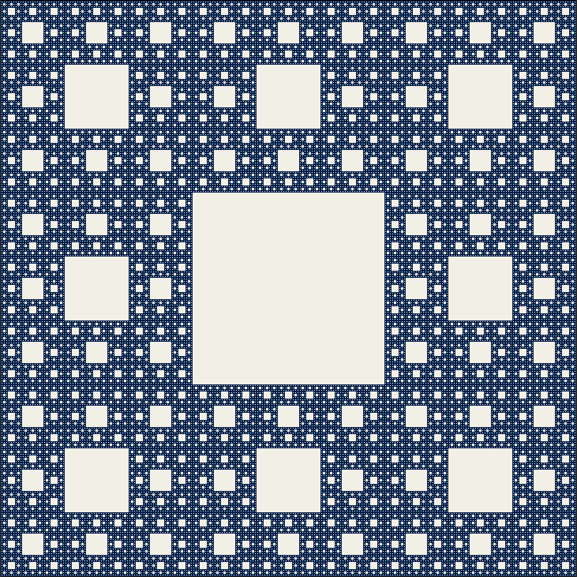

# Sierpinski Carpet

Simple Implementation in C. It is created for educational purposes only, It is not so efficiently written.



## Requirements
* [CMake](https://cmake.org/install/)
* [SDL2](https://wiki.libsdl.org/SDL2/Installation)

## Run
```sh
git clone https://github.com/nebulaw/sierpinski-carpet
cd sierpinski-carpet
./run.sh
`````
